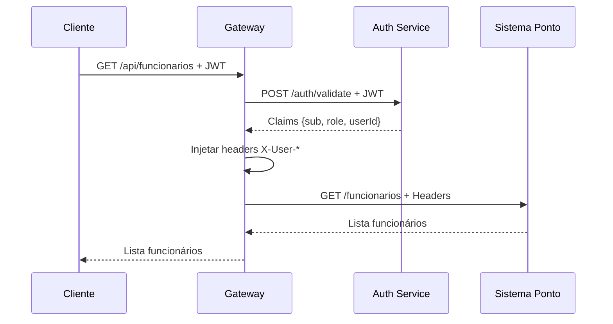

# ✅ Refatoração Concluída - API Gateway

## 🔄 **Mudanças Realizadas**

### 1. **JwtAuthFilter Refatorado**
```java
// ❌ ANTES: Validação própria
private Claims validateToken(String token) {
    SecretKey key = Keys.hmacShaKeyFor(secret.getBytes());
    return Jwts.parser().verifyWith(key).build().parseSignedClaims(token).getPayload();
}

// ✅ DEPOIS: Delegação para Auth Service
private Mono<Map<String, Object>> validateWithAuthService(String authHeader) {
    return webClient.post()
            .uri(authServiceUrl + "/auth/validate")
            .header("Authorization", authHeader)
            .retrieve()
            .bodyToMono(Map.class);
}
```

### 2. **Configuração Atualizada**
```yaml
# ❌ ANTES: Secret JWT duplicado
jwt:
  secret: minhachavesecretasuperseguraparaojwt123456789

# ✅ DEPOIS: URL do Auth Service
auth:
  service:
    url: http://localhost:8081
```

### 3. **Dependências Limpas**
```xml
<!-- ❌ ANTES: JWT libraries no Gateway -->
<dependency>
    <groupId>io.jsonwebtoken</groupId>
    <artifactId>jjwt-api</artifactId>
</dependency>

<!-- ✅ DEPOIS: Apenas WebClient -->
<!-- JWT dependencies removidas - delegação para Auth Service -->
```

### 4. **WebClient Configurado**
```java
@Configuration
public class WebClientConfig {
    @Bean
    public WebClient webClient() {
        return WebClient.builder()
                .codecs(configurer -> configurer.defaultCodecs().maxInMemorySize(1024 * 1024))
                .build();
    }
}
```

---

## 🎯 **Arquitetura Corrigida**

### **Fluxo Atual (Correto):**


---

## ✅ **Benefícios Alcançados**

### 1. **Responsabilidade Única**
- ✅ Gateway: Roteamento + Proxy + Headers
- ✅ Auth Service: Validação JWT exclusiva
- ✅ Sistema Ponto: Lógica de negócio

### 2. **Eliminação de Duplicação**
- ✅ Secret JWT apenas no Auth Service
- ✅ Lógica de parsing JWT centralizada
- ✅ Manutenção em um local único

### 3. **Consistência**
- ✅ Validação JWT sempre igual
- ✅ Formato de resposta padronizado
- ✅ Comportamento previsível

### 4. **Baixo Acoplamento**
- ✅ Gateway não conhece detalhes do JWT
- ✅ Mudanças no JWT afetam apenas Auth Service
- ✅ Comunicação via HTTP padrão

---

## 🚀 **Como Testar**

### 1. **Iniciar Serviços**
```bash
# Auth Service (porta 8081)
cd auth-service && mvn spring-boot:run

# Sistema Ponto (porta 8082)
cd sistema-ponto && mvn spring-boot:run

# API Gateway (porta 8080)
cd api-gateway && mvn spring-boot:run
```

### 2. **Fazer Login**
```bash
curl -X POST http://localhost:8080/auth/login \
  -H "Content-Type: application/json" \
  -d '{"login":"admin","senha":"admin123"}'
```

### 3. **Usar Token**
```bash
curl -X GET http://localhost:8080/api/funcionarios \
  -H "Authorization: Bearer <token-jwt>"
```

### 4. **Verificar Logs**
```
[JWT] Validando token via Auth Service
[JWT] Validação bem-sucedida via Auth Service
[JWT] Token válido para usuário: admin
```

---

## 📊 **Comparação Final**

| Aspecto | Antes | Depois |
|---------|-------|--------|
| **Validação JWT** | Gateway próprio | Delegada para Auth Service |
| **Secret JWT** | Duplicado | Apenas no Auth Service |
| **Dependências** | JWT libs no Gateway | Apenas WebClient |
| **Acoplamento** | Alto | Baixo |
| **Manutenção** | Duplicada | Centralizada |
| **Consistência** | Risco de divergência | Garantida |

---

## 🎉 **Resultado**

Gateway agora segue **princípios SOLID** e **arquitetura de microserviços** correta:
- **Single Responsibility**: Cada serviço tem uma responsabilidade
- **DRY**: Não há duplicação de código
- **Separation of Concerns**: Autenticação vs Roteamento separados