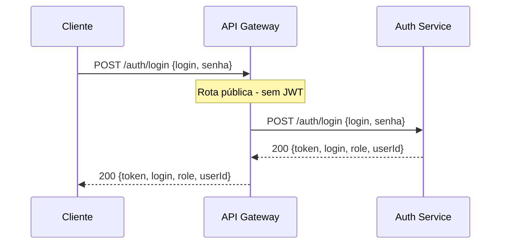
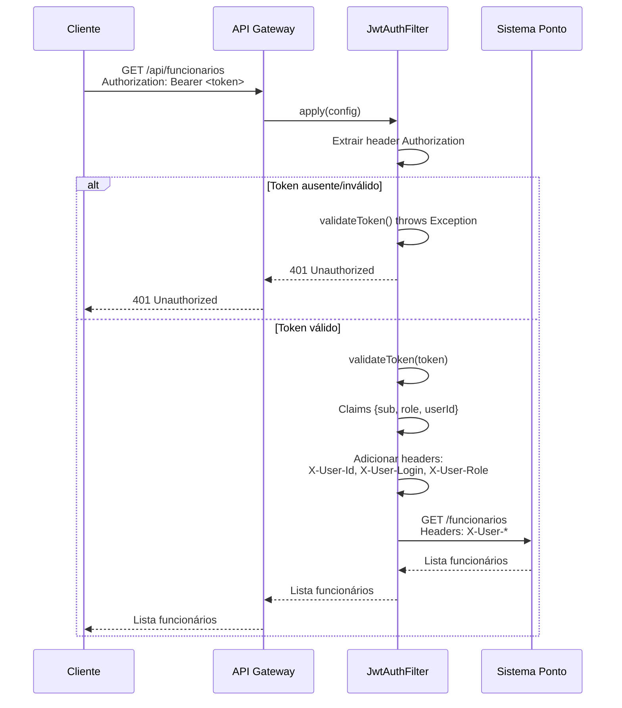
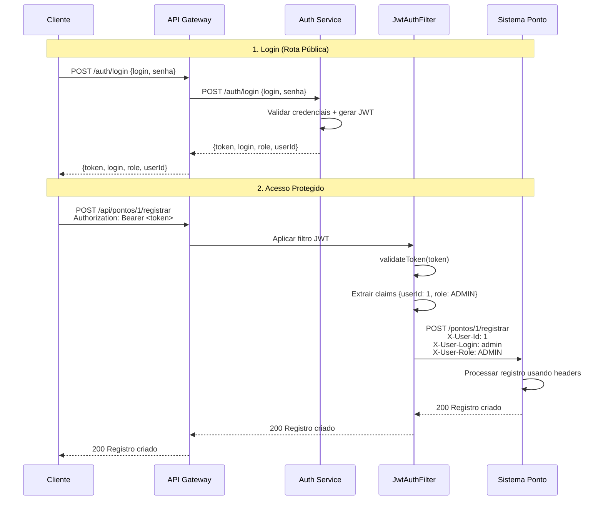
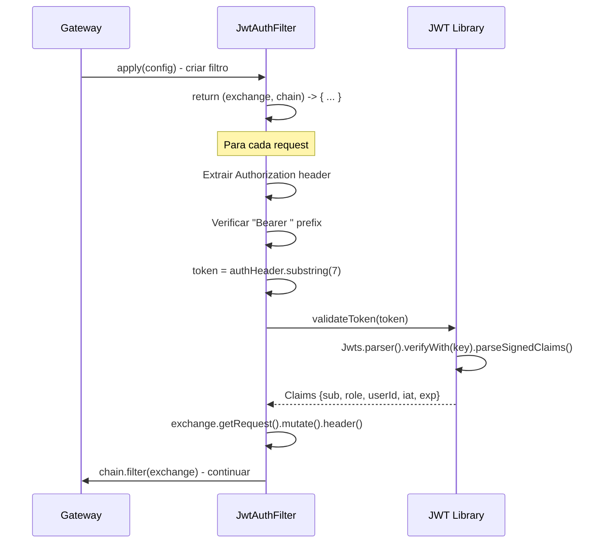
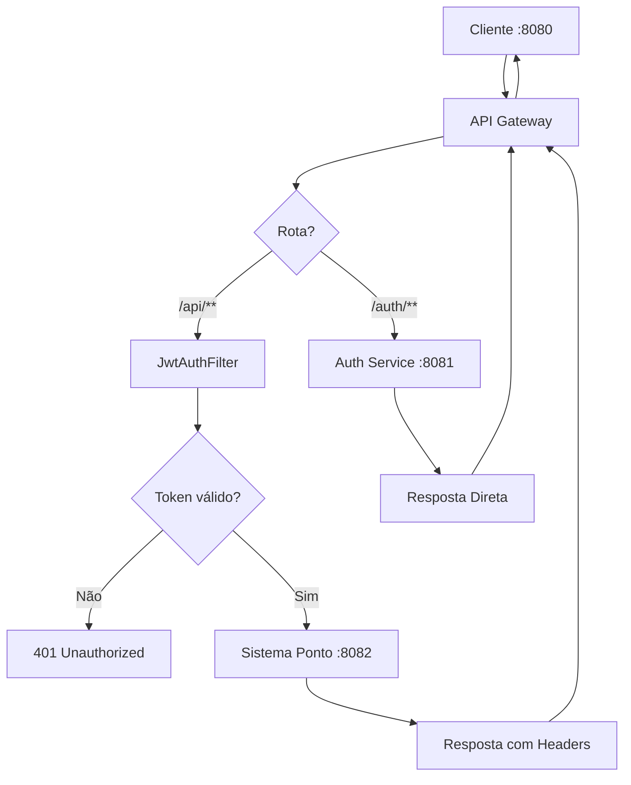

# Diagrama de Sequência - API Gateway

## 🚪 Fluxo de Roteamento Público (Auth Service)



## 🔐 Fluxo de Roteamento Protegido (Sistema Ponto)



## 🔄 Fluxo Completo de Autenticação + Acesso



## ⚙️ Fluxo Interno do JwtAuthFilter



## 🏗️ Arquitetura de Roteamento



## 📊 Configuração de Rotas (application.yml)

```yaml
spring:
  cloud:
    gateway:
      routes:
        # Rota Pública - Auth Service
        - id: auth-service
          uri: http://localhost:8081
          predicates:
            - Path=/auth/**
          # Sem filtros JWT
        
        # Rota Protegida - Sistema Ponto
        - id: sistema-ponto
          uri: http://localhost:8082
          predicates:
            - Path=/api/**
          filters:
            - name: JwtAuthFilter  # Aplica validação JWT
            - StripPrefix=1        # Remove /api do path
```

## 🔑 Headers Injetados pelo Gateway

| Header Original | Headers Injetados |
|----------------|-------------------|
| `Authorization: Bearer <token>` | `X-User-Id: 1` |
| | `X-User-Login: admin` |
| | `X-User-Role: ADMIN` |

## 📈 Estados de Resposta

| Cenário | Status | Descrição |
|---------|--------|-----------|
| Rota pública | 200/401 | Depende do auth-service |
| Token ausente | 401 | Unauthorized |
| Token inválido | 401 | Unauthorized |
| Token válido | 200/4xx/5xx | Depende do microserviço |

## 🔄 Ciclo de Vida da Requisição

1. **Recepção**: Gateway recebe request na porta 8080
2. **Roteamento**: Identifica rota baseada no path
3. **Filtros**: Aplica JwtAuthFilter se rota protegida
4. **Validação**: Valida JWT usando secret compartilhado
5. **Headers**: Injeta informações do usuário
6. **Proxy**: Encaminha para microserviço de destino
7. **Resposta**: Retorna resposta do microserviço ao cliente